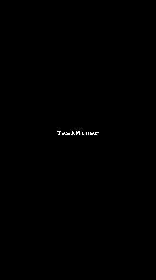

# TaskMiner

TaskMiner is a tiny tool on android to help people focus in their tasks.

## Current state

Currently TaskMiner only support Chinese, i18n will be done in the near future.

## How it work

TaskMiner is simple and clean. It only has a float window and a widget. 
Float window is used to perform task setting and timing. It can be dragged anywhere on the screen. When the window is dragged to the edge of the screen, it will transform to a small, halp-transparent coin, which has less distraction if you are viewing other apps.
Widget need to be added to screen from your launcher first. It will display your task records on the screen. Tasks can be deleted by clicking `X` button in the widget.

By setting a task, you will need to enter task content and minutes it will spend. 1 minute will bonus you 1 coin. This means easier work earn less, and harder one earns more. TaskMiner allows your task to be done over-time up to 2 * taskExpectedTime, which is the deadline. As you may not accurately eveluate how long time the task will spend, this machanism can help you realize how to eveluate a task and encourage you finishing the task. If you finish the task within expected time, you will earn all coins; If you finish the task overtime but not up to deadline, you will also earn coins, but coins will decrease by time passing; If you reach deadline, you will earn no coin and task will be failed.

Have fun with tasks!

## License

Apache 2.0
